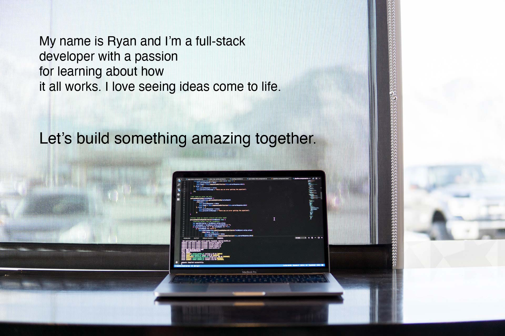

    

        
    

    

        

        <h4 align="center">Recent Activity & Stats</h4>
        

            
            
            
        

    

    

        

            <h2>I have experience in the following...</h2>
            <h4>Languages</h4>
                
                
                
                
                
                
                
                <!-- add badge for solidity -->
            <h4>Frameworks & Libraries</h4>
                <!-- add badge for wordpress -->
                
                
                
                
                <!-- add badge for axios? -->
            <h4>Databases</h4>
            <h4>Other Tools</h4>
            

        

        

        

    

    

    

